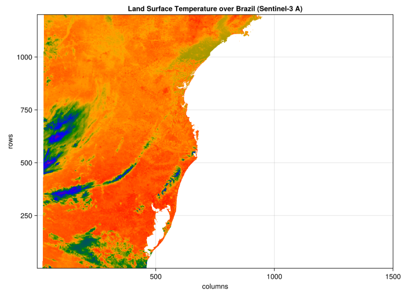

[](https://vlevasseur073.github.io/CopernicusData.jl/stable/)
[](https://vlevasseur073.github.io/CopernicusData.jl/dev/)
[](https://github.com/vlevasseur073/CopernicusData.jl/actions/workflows/CI.yml?query=branch%3Amain)
[](https://codecov.io/gh/vlevasseur073/CopernicusData.jl)

# CopernicusData.jl

CopernicusData is a framework for Earth Observation satellite data processing.
It defines a data structure for managing, storing EO data and a light orchestration framework to implement and chain processing steps.



## Data Structure

The data structure used in `CopernicusData.jl` is mostly focused on zarr format, 
using [`Zarr.jl`](https://github.com/JuliaIO/Zarr.jl) package.
The data representation is based on [`YAXArrays.jl`](https://github.com/JuliaDataCubes/YAXArrays.jl).

### `YAXTrees` module

 The `YAXTrees` module provide a hierarchical tree structure of `YAXArrays` or `Datasets`.
 It is particularly useful for handling any kind of complex data structures like Zarr groups or JSON hierarchies.

More specifically, using the Zarr backend, a recursive zarr structure representing Copernicus product can be accessed with the `open_datatree`
function.
A SEN3 driver (*in progress*) also enables to open Sentinel-3 products using the former SAFE data format.
Using the feature from YAXArrays.jl, based on DiskArrays.jl, the data is lazy loaded.


#### Creating Trees

```julia
# Create an empty root node
root = YAXTree()

# Create a node with a specific name
node = YAXTree("mynode")

# Create a node with data
using YAXArrays
data = YAXArray((Dim{:rows}(1:10),), collect(1:10))
data_node = YAXTree("data_node", data=data)

# Add children to a tree
root = YAXTree()
add_children!(root, "child1")  # Add empty child
add_children!(root, "child2", data)  # Add child with data

# Add nested children using a path
add_children_full_path!(root, "path/to/deep/child", data)
```

## Orchestration

A light orchestration is providing by the ̀`EOTriggering` module.

* Run processing workflows from a TOML payload file
* Support for configurable logging levels (Debug, Info)
* Processing workflow configuration with:
  * Module and processing unit specification
  * Input product configuration
  * Parameter handling for processing units
  * Support for auxiliary data files
* Simple error handling and reporting
* Modular processing unit execution through function calls
* Support for multiple input products as YAXTrees


## Utilities

To ease basic actions dealing with zarr products and S3 object storage, few utilies and helper functions have been implemented:

* Utilities for uploading Zarr datasets and files to S3-compatible object storage
* Functions for walking Zarr directory structures and uploading all contents with correct content types
* Support for custom S3 object metadata and content type inference
* Error handling and logging for upload operations
* AWS configuration helpers:
  * Read AWS credentials and config from INI files or environment variables
  * Support for custom endpoints and regions (e.g., for on-prem/cloud S3)
  * Custom AWS config struct for flexible service URL generation
* S3 helper functions:
  * List objects in a bucket or prefix
  * Retrieve objects from S3 by full path

## Release note

For further details, have a look at the release note:
